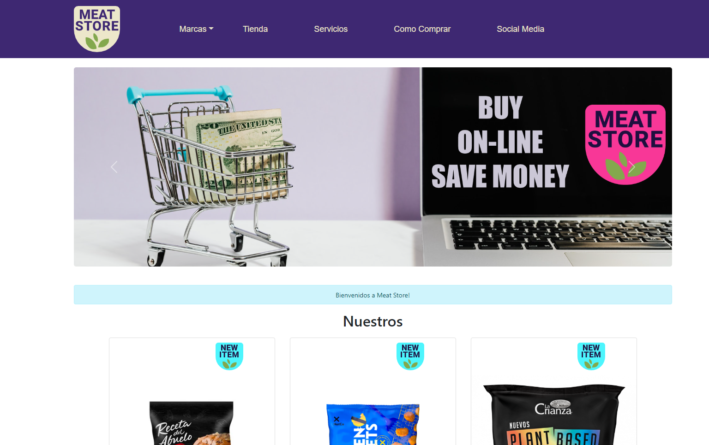

# Meat Store e-commerce


* Meat Store es una tienda on-line, con una variedad de productos basados el plantas.
* Productos con alto contenido proteico y alternativas al momento de comer.




## Comenzando 🚀

_Estas instrucciones te permitirán obtener una copia del proyecto en funcionamiento en tu máquina local para propósitos de desarrollo y pruebas._

### Pre-requisitos 📋

_Que cosas necesitas para instalar el software y como instalarlas_

_Dependencias_

```
react-router-dom
react-icon
react-bootstrap
sweetalert2
firebase
```

### Instalación 🔧

_Para el uso de este repositorio primero debes clonarlo_

_primero_

```
git clone
```

_luego de la clonacion, en consola realizar lo siguiente, para instalar las dependencias_

```
npm install
```

_Finaliza con un ejemplo de cómo obtener datos del sistema o como usarlos para una pequeña demo_


### Codigo ⌨️
* JSX


##  Font
### Quicksand

* https://fonts.google.com/specimen/Quicksand

##  Styles
* Paleta de colores

#1e0f3f
#ffffff 
#ece7ca
#f83797
#4df5fd
#2f1c5c
#3e2872

## Despliegue online y offline 📦

_en Vercel.app y Firebase.app_
_npm run start_

## Autor ✒️

_Menciona a todos aquellos que ayudaron a levantar el proyecto desde sus inicios_

* **Daniel Lugo** - *Trabajo Inicial* - [daniellfreelancer](https://github.com/daniellfreelancer)
* **Daniel Lugo** - *Documentación* - [Daniel Lugo](#Daniel Lugo)

⌨️  por [daniellfreelancer](https://github.com/daniellfreelancer)     😊
